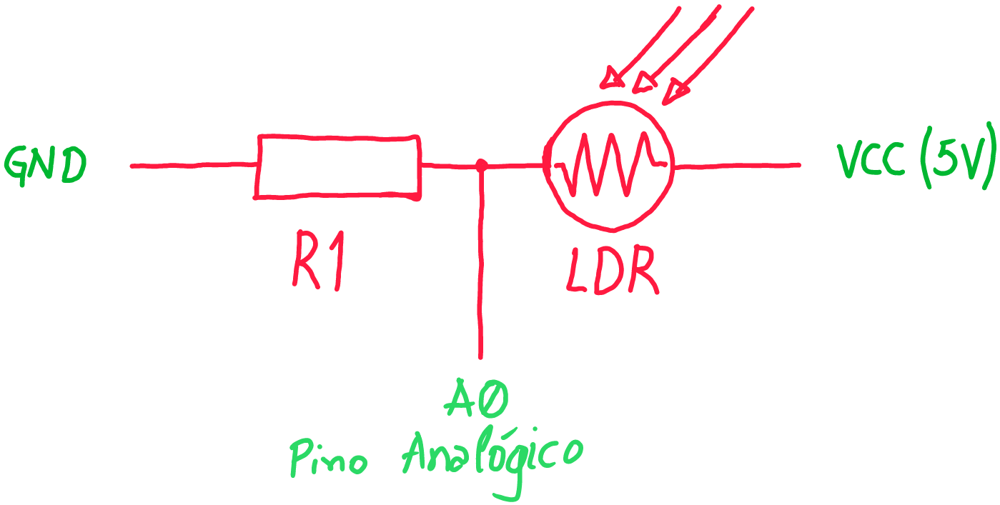

# 🌞 Sensor de Luminosidade (LDR)

Pequeno guia didático para utilizar o **módulo LDR** em projetos com **Arduino**.  
O LDR (Light Dependent Resistor) é um sensor que varia sua resistência conforme a quantidade de luz incidente.  
Com ele podemos detectar se está claro ou escuro, medir níveis de luminosidade e automatizar sistemas.

---

### Como funciona?

O LDR é um componente cuja resistência elétrica varia conforme a quantidade de luz que incide sobre ele:

- **Ambiente claro:** a resistência do LDR diminui.
- **Ambiente escuro:** a resistência do LDR aumenta.

Assim, ele permite a passagem de mais ou menos corrente elétrica de acordo com a luz do ambiente.

### Para que serve?

O LDR é usado em projetos que precisam identificar se está claro ou escuro, como:

- Lâmpadas automáticas
- Sistemas de alarme
- Robôs seguidores de linha
- Medidores simples de luz

### Exemplo prático com Arduino

No Arduino, conectamos o LDR em um dos pinos analógicos. O Arduino lê um valor (de 0 a 1023) relacionado à quantidade de luz no ambiente. Quanto mais luz, maior o valor lido.

```cpp
int valorLuz = analogRead(A0); // Lê o valor do sensor LDR
```

---

## Informações Técnicas sobre o LDR

- **Princípio de funcionamento:** Feito de material semicondutor (geralmente sulfeto de cádmio, CdS). Quando a luz incide sobre ele, elétrons ganham energia e diminuem a resistência.
- **Faixa de resistência:** Pode variar de algumas centenas de ohms (Ω) em ambientes claros até vários megaohms (MΩ) no escuro.
- **Tempo de resposta:** Varia de dezenas a centenas de milissegundos, dependendo do modelo.
- **Tensão máxima:** Normalmente até 150V, mas em projetos com Arduino, utiliza-se 3,3V ou 5V.
- **Temperatura de operação:** Tipicamente entre -30ºC e +70ºC.

---

## Teoria Elétrica: Divisor de Tensão com LDR

O LDR normalmente é usado com um resistor fixo, formando um **divisor de tensão**. Esse circuito transforma a variação de resistência do LDR em uma variação de tensão, que o Arduino pode ler.

### Esquema do circuito




### Fórmula do divisor de tensão

A tensão no ponto entre o LDR e o resistor fixo (pino analógico) é dada por:

\[
V_{out} = V_{cc} \times \frac{R_{2}}{R_{1} + R_{2}}
\]

Onde:
- \(V_{cc}\) é a tensão de alimentação (ex: 5V)
- \(R_{1}\) é a resistência do LDR (varia com a luz)
- \(R_{2}\) é o resistor fixo

#### Comportamento do circuito

- **Ambiente claro:** O LDR tem baixa resistência (\(R_1\) pequeno), então \(V_{out}\) se aproxima de 0V.
- **Ambiente escuro:** O LDR tem alta resistência (\(R_1\) grande), então \(V_{out}\) se aproxima de \(V_{cc}\).

---

### Como escolher o valor do resistor fixo?

A escolha do resistor fixo (\(R_2\)) é fundamental para definir a sensibilidade do circuito à luz. O valor ideal depende das características do LDR e da faixa de iluminação que você quer detectar.

**Dica prática:**  
Escolha \(R_2\) próximo ao valor médio da resistência do LDR na faixa de luz que mais te interessa. Por exemplo, se o LDR varia de 1kΩ (muita luz) a 100kΩ (pouca luz), um resistor de 10kΩ a 50kΩ é uma boa escolha.

#### Exemplo de cálculo prático

Suponha:
- LDR: 5kΩ no claro, 50kΩ no escuro
- Resistor fixo: 10kΩ
- \(V_{cc} = 5V\)

**No claro:**
\[
V_{out} = 5V \times \frac{10kΩ}{5kΩ + 10kΩ} = 5V \times \frac{10}{15} \approx 3,33V
\]

**No escuro:**
\[
V_{out} = 5V \times \frac{10kΩ}{50kΩ + 10kΩ} = 5V \times \frac{10}{60} \approx 0,83V
\]

Assim, o Arduino pode diferenciar facilmente as condições de luz pelo valor lido no pino analógico.

---

**Resumo:**  
A escolha do resistor fixo ajusta a sensibilidade do circuito. O divisor de tensão converte a variação de resistência do LDR em um sinal de tensão compreensível para o Arduino, facilitando o uso em projetos de automação, robótica e eletrônica educacional.

---

## Tipos de módulos

### Módulo de 3 pinos
- **VCC** → alimentação (3,3 V ou 5 V)  
- **GND** → terra  
- **D0** → saída **digital** (0 ou 1)  

> Nesse caso, o comparador LM393 gera apenas uma saída digital.  
> O **potenciômetro azul** ajusta a sensibilidade do limite claro/escuro.

---

### Módulo de 4 pinos
- **VCC** → alimentação (3,3 V ou 5 V)  
- **GND** → terra  
- **D0** → saída **digital** (0 ou 1)  
- **A0** → saída **analógica** (0–1023 no Arduino UNO)  

> Esse modelo é mais completo: além da saída digital, também fornece a leitura analógica proporcional à luz ambiente.

---

## Conexões básicas

| Módulo LDR | Arduino UNO |
|------------|-------------|
| VCC        | 5V          |
| GND        | GND         |
| D0         | D2          |
| A0 (se tiver) | A0       |

---

## Exemplos de código

### 1. Usando saída digital (D0)

```cpp
#define LDR_D0 2
#define LED    13

void setup() {
  pinMode(LDR_D0, INPUT);
  pinMode(LED, OUTPUT);
  Serial.begin(9600);
}

void loop() {
  int estado = digitalRead(LDR_D0);

  if (estado == LOW) {
    digitalWrite(LED, HIGH);
    Serial.println("Escuro → LED ACESO");
  } else {
    digitalWrite(LED, LOW);
    Serial.println("Claro → LED APAGADO");
  }

  delay(200);
}
```

---

### 2. Usando saída analógica (A0)

```cpp
#define LDR_A0 A0
#define LED    9

void setup() {
  pinMode(LED, OUTPUT);
  Serial.begin(9600);
}

void loop() {
  int valor = analogRead(LDR_A0);
  Serial.print("Luminosidade: ");
  Serial.println(valor);

  int brilho = map(valor, 0, 1023, 255, 0);
  analogWrite(LED, brilho);

  delay(200);
}
```

---

## Aplicações práticas
- Acender lâmpada automática ao escurecer.  
- Ajustar brilho de telas e LEDs.  
- Projetos de automação residencial.  
- Sensores para robôs que detectam variação de luz.  

---

## Materiais necessários
- Arduino UNO (ou compatível)  
- Módulo LDR (3 pinos ou 4 pinos)  
- Jumpers  
- Protoboard  
- LED e resistor (220 Ω)  

---

## Referências
- [Documentação Arduino](https://www.arduino.cc/)  
