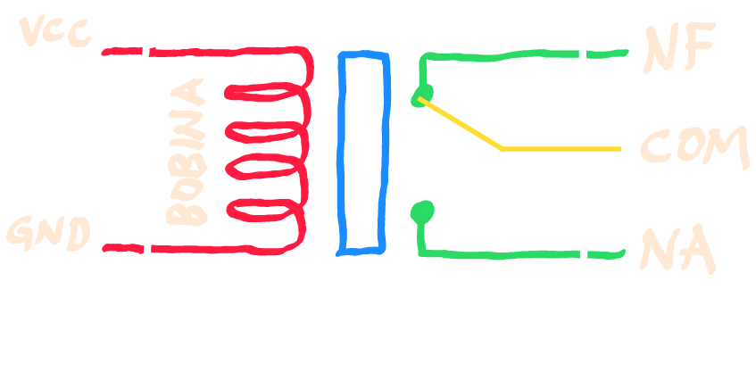

# Relé – Guia Didático com Arduino

Pequeno guia para entender o funcionamento do **Relé** e como utilizá-lo em projetos com **Arduino**.

---

## O que é um Relé?
O **Relé** é um **interruptor controlado eletricamente**. Ele permite que um sinal de baixa potência (como o de um Arduino) controle cargas de maior potência, como lâmpadas, motores ou ventiladores.

---

## Estrutura do Relé



- **Bobina** → cria um campo magnético quando energizada e liga o relé.  
- **COM (Comum)** → pino central de saída.  
- **NA (Normalmente Aberto)** → liga somente quando o relé é acionado.  
- **NF (Normalmente Fechado)** → permanece ligado até o relé ser acionado.  

---

## Aplicações
- Automação residencial (luzes, ventiladores, bombas d’água).  
- Controle de motores em robótica.  
- Sistemas automotivos (buzinas, faróis, vidros elétricos).  

---

## Cuidados
- Use **módulos de relé prontos**, pois eles já vêm com transistor e diodo de proteção.  
- Verifique a **tensão e corrente** suportada pelo relé (ex.: 220V, 10A).  
- Tome cuidado ao manusear **corrente alternada (AC)**.  

---

## Exemplo com Arduino

Abaixo um exemplo simples de como ligar um relé no **pino 7** do Arduino para acionar uma lâmpada:

```ino
/*
  Exemplo: Controle de Relé com Arduino
  Liga e desliga um relé no pino 7 a cada 2 segundos.
  Professor Claudio Roberto da Silva
*/

#define PIN_RELE 7   // Pino de controle do relé

void setup() {
  pinMode(PIN_RELE, OUTPUT);
  digitalWrite(PIN_RELE, LOW); // Relé inicia desligado
}

void loop() {
  digitalWrite(PIN_RELE, HIGH); // Liga relé
  delay(2000);                  // Aguarda 2s
  digitalWrite(PIN_RELE, LOW);  // Desliga relé
  delay(2000);                  // Aguarda 2s
}
```

---

## Esquema de Conexão
- **VCC** → Pino 7 do Arduino (5V) 
- **GND** → GND do Arduino   
- **COM** → Entrada de energia da carga  
- **NA**  → Saída da carga (liga quando acionado)  

> Use sempre cargas **compatíveis** com as especificações do relé.

